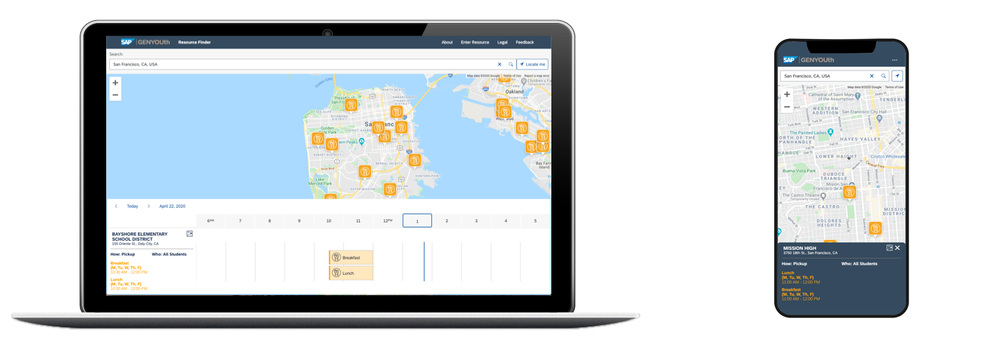
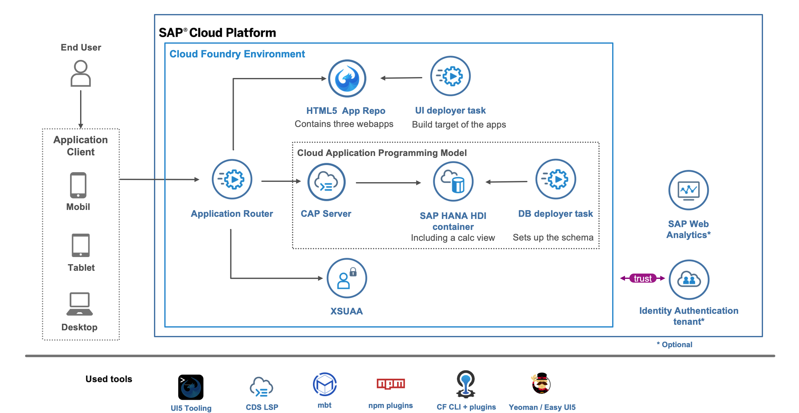

# SAP4Kids

In response to the current COVID-19 pandemic and its resulting impact on students and families, GENYOUth, child health and wellness nonprofit, and SAP, market leader in enterprise software sales, have created the SAP4Kids application.

It's our goal to ensure families have access to the food and resources they need when they need them. For this, we developed an application they can use to find available resources in their neighborhood.



Check out the application running in production for a [live demo](https://sap4kids-prod-sap4kids.cfapps.us10.hana.ondemand.com/).

## Description

This repository contains the entire source code of this application, so it can be adapted and used by other organizations. We also think it is an excellent resource for many developers to see how SAP technology can be used to make the world run better.
This project consists of three distinct web applications:

- Assistance Entry Form

      Provides a quick way for organizations to submit information on feeding

  sites and other free resources (i.e. financial, workforce, housing, and healthcare) they provide to help
  students and families.

- Approval List

  All entered data needs to be approved by an admin to be shown on the map.

- Resource Locator

  An interactive map that helps students and families find resources near them.

## Requirements

- Create your own [Google Maps API Key](https://developers.google.com/maps/documentation/javascript/get-api-key)
- Install Node.js LTS version 10 from <https://nodejs.org/en/download/>.
- [Create](https://developers.sap.com/tutorials/hcp-create-trial-account.html) an SAP Cloud Platform trial account in the region Europe (Frankfurt)
- [Follow this tutorial](https://developers.sap.com/tutorials/cp-cf-download-cli.html) to install the Cloud Foundry command-line tool.
- Add the Multi-Target Application Cloud Foundry [CLI Plugin](https://github.com/cloudfoundry-incubator/multiapps-cli-plugin).
  ```
  cf add-plugin-repo CF-Community https://plugins.cloudfoundry.org
  cf install-plugin multiapps
  ```
- Install make via a package manager...

  ...for Mac users: This tool should be preinstalled on your machine.

  ...for Windows users (install [chocolatey](https://chocolatey.org/install) first).

  ```
  choco install make
  ```

- Install SQLite3 via a package manager...

  ...for Mac users (install [brew](https://brew.sh/) first).

  ```
  brew install sqlite
  ```

  ...for Windows users (install [chocolatey](https://chocolatey.org/install) first).

  ```
  choco install sqlite
  ```

Optional: Set up the [SAP Web Analytics service](https://developers.sap.com/tutorials/cp-webanalytics-setup.html) if you want to add it to the project

## Download and Installation

### Cloud Deployment

1. Clone the project.
   ```
   git clone https://github.com/SAP-samples/SAP4Kids
   cd SAP4Kids
   npm install
   ```
2. Open the project with VS Code.
   ```
   code .
   ```
3. Replace the placeholder for the Google Maps Key, the reCaptcha site key, and the Web Analytics token in the key files (`ui_form/webapp/resources/keys.js` and `ui_map/webapp/resources/keys.js`)
4. Build and deploy the project to the cloud.
   ```bash
   npm run deploy # deploys to a production account
   # npm run deploy:trial # deploys to a trial account
   ```
5. Wait until the process completed and look for the output line, which references the URL of the started app router. Open the displayed URL in a browser.
6. Open the SAP Cloud Platform Cockpit and assign the role collection `DataAdmin` to your user (compare to step two of [this tutorial](https://developers.sap.com/tutorials/cp-cf-processvisibility-setup-assignroles.html))

### Local Development

Explain why local DB just for assistance entry / FE app

1. Clone the project.
   ```
   git clone https://github.com/SAP-samples/SAP4Kids
   cd SAP4Kids
   npm install
   ```
2. Open the project with VS Code.
   ```
   code .
   ```
3. Replace the placeholder for the Google Maps Key, the reCaptcha site key, and the Web Analytics token in the key files (`ui_form/webapp/resources/keys.js` and `ui_map/webapp/resources/keys.js`)
4. Initialize the SQLite database via `npm run deploy:cds`.
5. Start the app with `npm start`
6. The backend service will run on <http://localhost:4004> and the web apps on port [8080 (entry form)](http://localhost:8080/index.html), [8081 (interactive map)](http://localhost:8081/index.html), and [8082 (approval app)](http://localhost:8082/index.html).

> When prompted for a password, enter the user name `alice` and confirm with an empty string as password.

## Architecture

The project consists of the following modules and services:

Have a look at the [detailed architecture page](./docs/architecture.md) for more information.

## Known Issues

- The map only displays records within a 200 mile radius of the specified location. Interacting with the map (dragging or zooming in/out) has no effect on the displayed assistance locations.

## How to obtain support

This content is provided "as-is" with no other support.

## License

Copyright (c) 2020 SAP SE or an SAP affiliate company. All rights reserved.
This file is licensed under the Apache Software License, version 2.0 except as noted otherwise in the [LICENSE](LICENSE) file.
